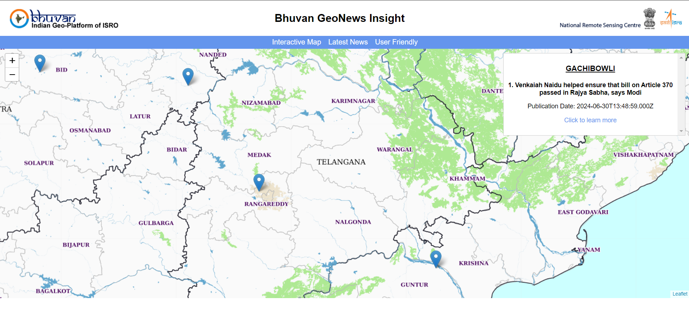

# Bhuvan GeoNews Insight

## Overview
This project is a web-based platform designed to showcase nationally important news articles on a map of India. The platform uses various machine learning and natural language processing techniques to classify news articles and map them to relevant locations across India.



## Features
- **Web Scraping**: Gathered news articles from major sources such as Indian Express, NDTV, India Today, and India TV using BeautifulSoup.
- **Text Classification**: Implemented an LSTM-based model with TensorFlow to classify articles based on national relevance and positive sentiment, achieving an accuracy of 84.88%.
- **Location Extraction**: Trained a spaCy model with transfer learning to extract location information from news content, achieving 78% accuracy.
- **Geocoding**: Utilized GeoPy to convert extracted locations into geographical coordinates for map placement.
- **Interactive Map**: Designed a user-friendly web interface using Leaflet.js to display news locations on an interactive map of India.

## Tech Stack
- **Backend**: PostgreSQL, TensorFlow, spaCy, GeoPy
- **Frontend**: HTML/CSS, Leaflet.js
- **Web Scraping**: BeautifulSoup
- **Server**: Node.js (with Express.js)

## Installation Instructions

### Prerequisites
- Node.js
- PostgreSQL
- Python (with required libraries)

### Backend Setup
1. Install PostgreSQL and set up the database with necessary tables.
2. Ensure Python is installed with the following packages:
    ```bash
    pip install beautifulsoup4 tensorflow spacy geopy
    ```
3. Download the spaCy language model:
    ```bash
    python -m spacy download en_core_web_lg
    ```

### Frontend Setup (WEB_GUI)

1. Navigate to the `geo_latest` folder.
2. Install required Node.js packages:
    ```bash
    npm install express pg
    ```
3. Set up your Leaflet.js environment within the frontend directory.

### Running the Project
1. Run the Node.js server:
    ```bash
    node server.js
    ```
2. Access the web interface by navigating to `http://localhost:3000` in your browser.

## Usage
- Open the web application to view a map of India.
- Click on markers to view nationally important news articles related to that location.
- The map automatically updates as new articles are classified and geocoded.

## Contributing
Please feel free to submit issues or pull requests if you'd like to contribute to this project.
